# Medical Insurance Cost Predictor (Sigorta Maliyeti Tahmin Aracı)

 Bu proje, hastaların sağlık ve bazı diğer verilerini (yaş, BMI, sigara kullanımı vb.) kullanarak bireysel sigorta masraflarını tahmin etmeyi amaçlar. Asıl hedef , tahmini en düşük hata payı ile yapıcak metodu bulmaktır. 

---

## a)Simple Linear Regression (Basit Doğrusal Regresyon)

Bu kısım, projenin tek bir değişkene dayalı basit bir Lineer Regresyon modeliyle nasıl başlayacağını gösterir. Modelin amacı, bir eğim (m) ve bir sabit (b) üzerinden tahmin yapmaktır.

Tahmin Formülü:  

 

### 1. Hata Fonksiyonu (Cost Function / MSE)
Modelin eğitim sürecinde, tahminlerin gerçek değerlerden ne kadar saptığını ölçmek için Ortalama Kare Hata (MSE) kullanılır.
Büyük MSE değerlerini anlamlı bir şekilde yorumlayabilmek için RMSE kullanabiliriz (MSE'nin kökü).

Hata Fonksiyonu Görseli:   

### 2. Türev ve Güncelleme (Gradient Descent)
Hatanın minimuma inmesi için m ve b değerlerini güncelleyen türevler (Gradyanlar) hesaplanır:

m için Türev Görseli:   
  

b için Türev Görseli:   
  
 
Parametre Güncelleme Kuralı Görseli:   
 

### 3. Simple Linear Regression Yetersizliği
Bu görsel, tek bir değişkene dayanan Simple Linear Regression'ın (sadece BMI) sigorta maliyeti verisi üzerinde çizdiği doğruyu göstermektedir. Görüldüğü gibi, sadece BMI verisi kullanılarak maliyet hesabı tahmin edilmekte, fakat diğer veriler kullanılmadığı için (yaş, sigara kullanımı, cinsiyet vb.) gerçekçi değerler ortaya koymamaktadır.

BMI ve Maliyet İlişkisi Görseli:      
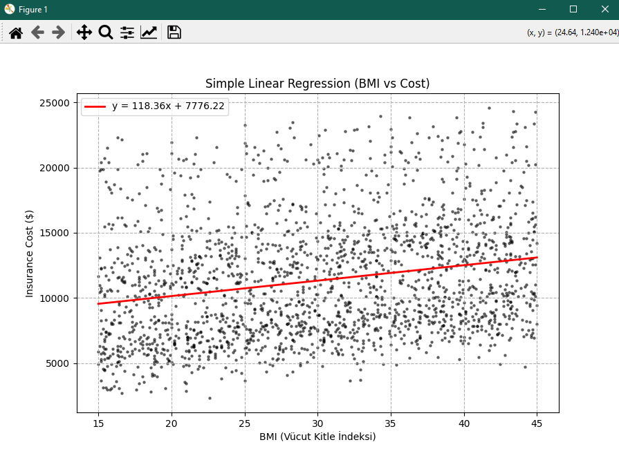

---

Neden Tek Değişkenli Regresyon Yetmedi?

Simple Linear Regression, verinin yanlızca bir değişkene bağlı değiştiğini varsayar.

Ancak, sigorta masrafları karmaşıktır. Bir kişinin maliyetini belirleyen yüzlerce faktör vardır:
* Yaş
* BMI (Vücut Kitle İndeksi)
* Sigara Kullanımı
* Kronik Hastalıklar

Bu nedenle tek bir eğim katsayısı (**m**) yeterli olmaz. Artık her faktörün maliyet üzerindeki etkisini gösteren kendi ağırlığına (W) ihtiyacımız var. Her feature için değişen m değerleri gibi düşünebiliriz. 

Özetle, basit bir y = mx + b yerine, y = w_1x_1 + w_2x_2 + ... + b gibi çok daha güçlü bir matematik kullanıyoruz.

---
## b)Multiple Linear Regression (Çoklu Doğrusal Regresyon)

## Veri İşleme Adımları

Modelin sağlıklı sonuç verebilmesi için veriyi düzenledik:

* Temizleme: Eksik verileri (NaN içeren satırlar) df.dropna() ile kaldırdık.
* Ordinal Sayıya Çevirme: Sıralı kategorik verileri (low, medium, high) 0, 1, 2 gibi sayılara çevirdik.
* Nominal Sayıya Çevirme (One-Hot Encoding): Sıralanamayan metin verilerini (male, female, region) One-Hot Encoding yöntemiyle (1'ler ve 0'lar) sayısallaştırıldık.
* Ayırma: Veriyi %80 Eğitim ve %20 Test olarak ayırıp modelin ezber yapmasını engelledik.

---

## Model Performansı ve Görsel Kanıtlar

Modelin eğitimi sonrasında, sonuçları test verileri (Verilerin %20 si) üzerinde değerlendirdik.
Model, sigorta maliyetlerinin geniş aralığı (birkaç binden on binlerce dolara) düşünüldüğünde, oldukça düşük bir hata payı yakalamıştır.

### 1. Modelin Temel Başarısı
Model, sigorta maliyetlerinin geniş aralığı (birkaç binden on binlerce dolara) düşünüldüğünde, oldukça düşük bir hata payı yakalamıştır.

* RMSE (Kök Ortalama Kare Hatası): $975
 	* Anlamı: Modelin yaptığı tahminler, gerçek maliyetten ortalama 975 Dolar sapmıştır. 

---

### 2. Özelliklerin (Feature) Maliyete Etkileri

Çoklu Doğrusal Regresyon modeli, her bir özelliğin (feature) maliyete olan katkısını pozitif veya negatif ağırlıklar atayarak ölçer. Aşağıdaki görseller, diğer tüm değişkenler sabit kaldığında, seçili özelliğin tek başına maliyeti nasıl etkilediğini göstermektedir:

#### Pozitif Korelasyonu Olanlar (Maliyet Artıranlar)
 Sigara, diyabet, yüksek tansiyon ve ileri yaş gibi faktörler sağlık riskini artırdığı için sigorta maliyetini yükseltir.
 
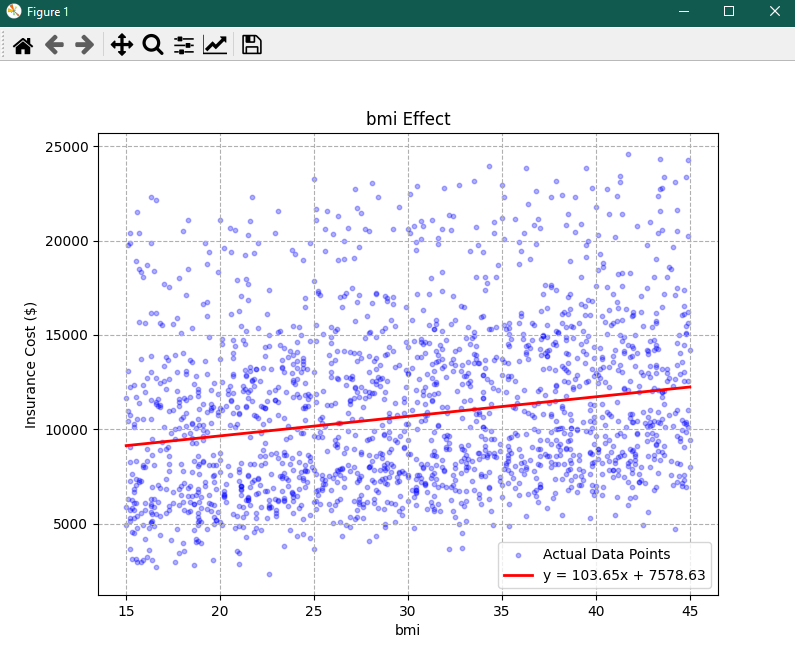 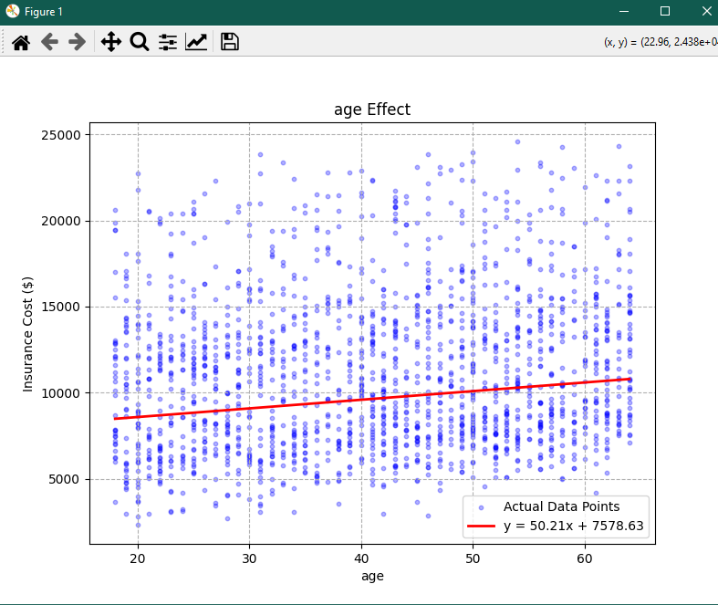

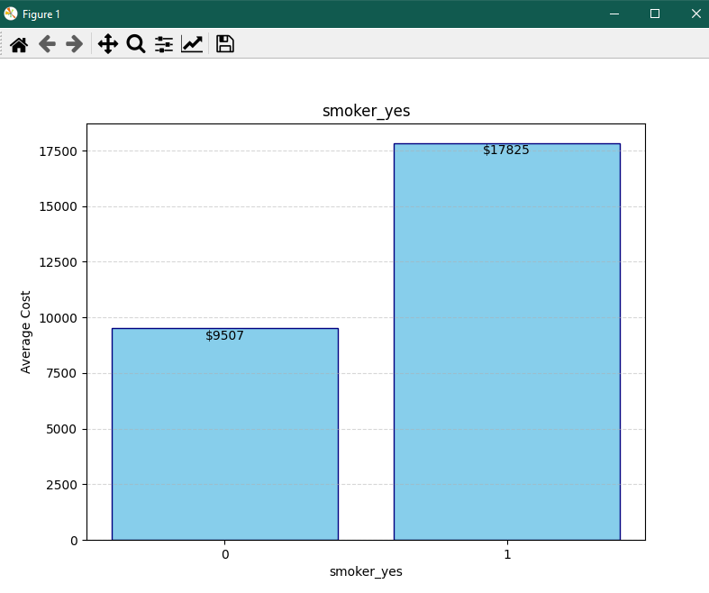 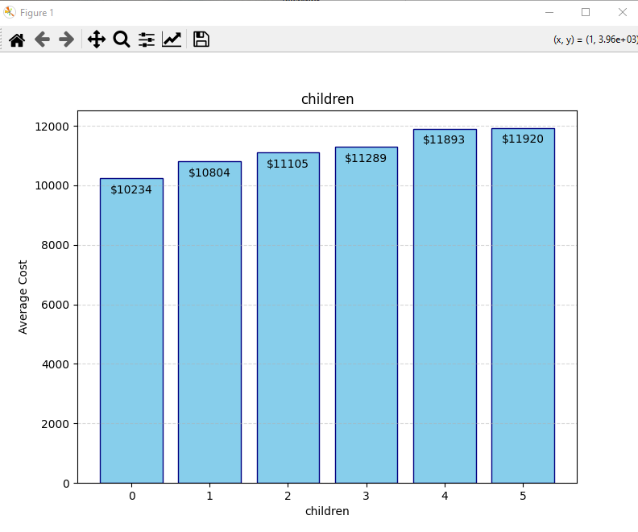

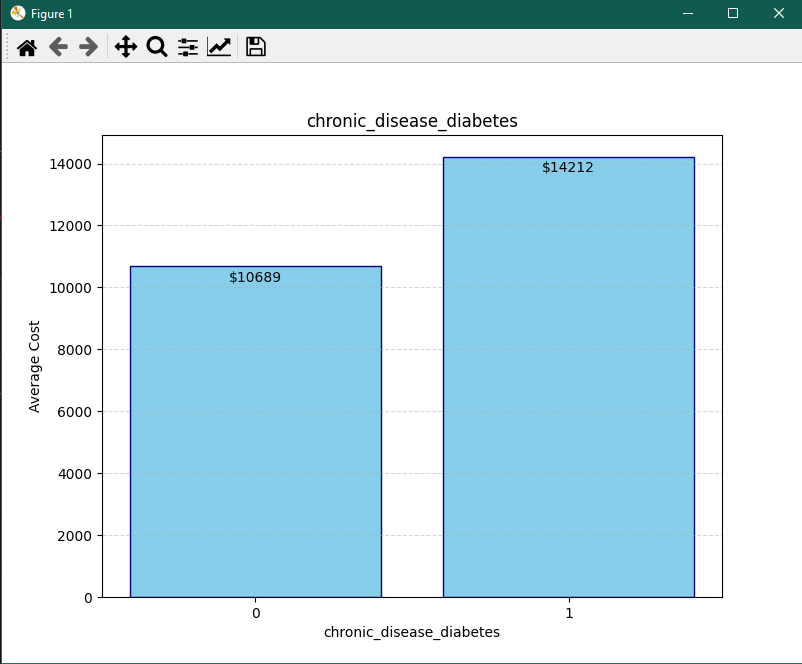 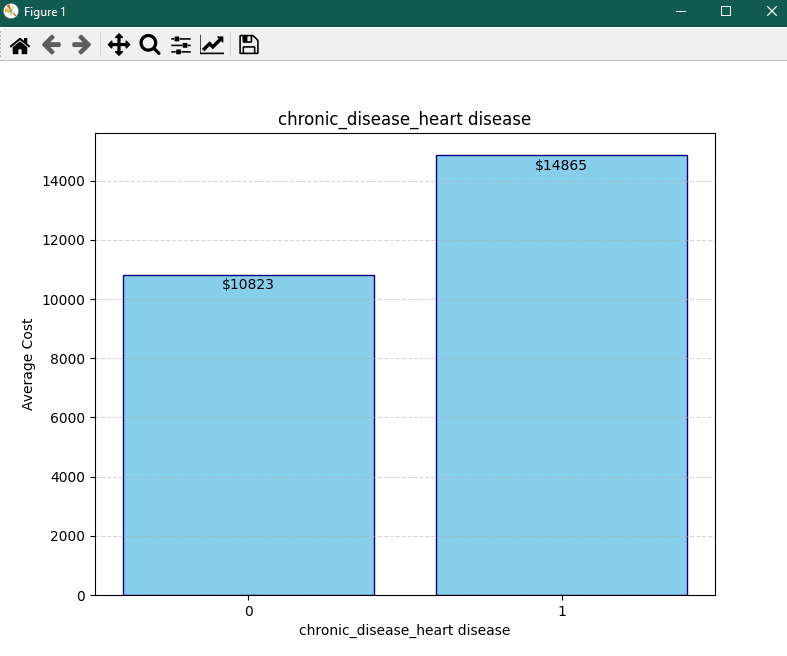

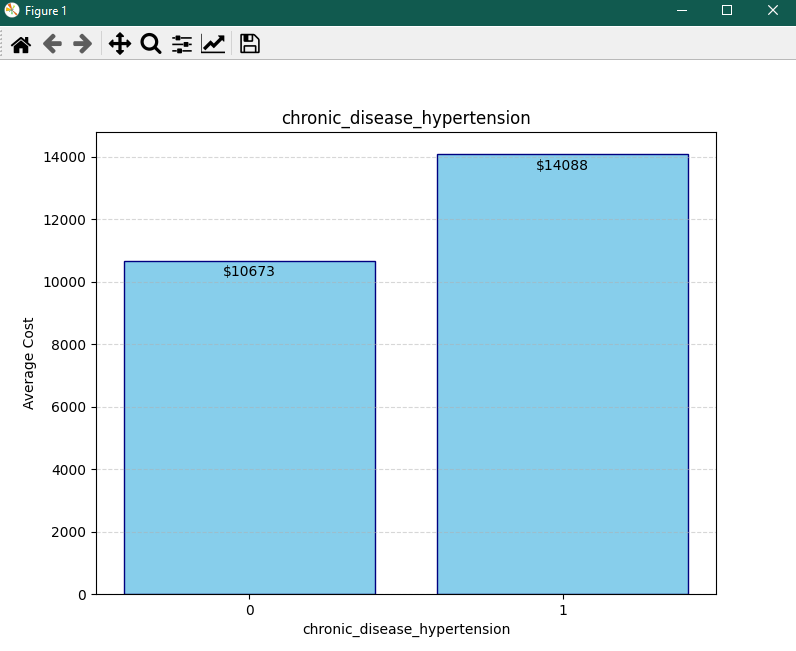
 

#### Negatif Korelasyonu Olanlar (Maliyeti Azaltanlar)
 Düzenli egzersiz,kronik hastalığa sahip olmamak ve sigara kullanmamak riskleri azalttığı için sigorta maliyetini düşürür.
 
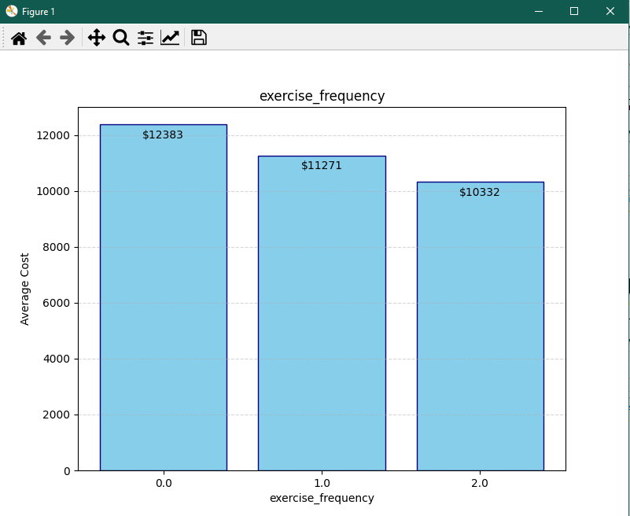 
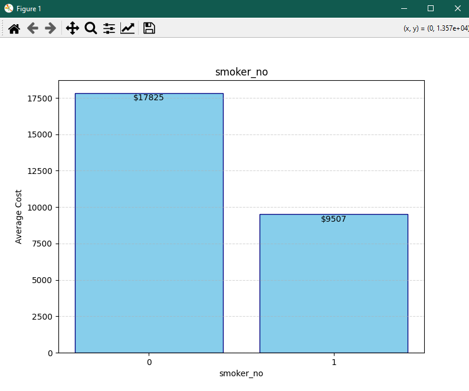

#### Belirgin Korelasyonu Olmayan Örnek
 Cinsiyet ve gelir düzeyi gibi faktörlerin sağlığa doğrudan bir etkisi olmadığı için maliyeti önemli ölçüde değiştirmez.
 
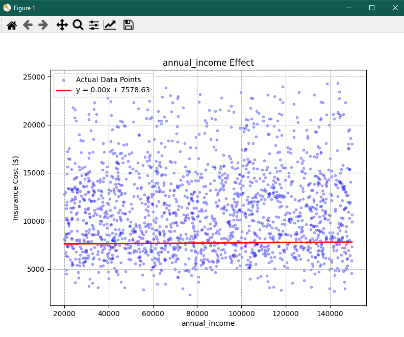 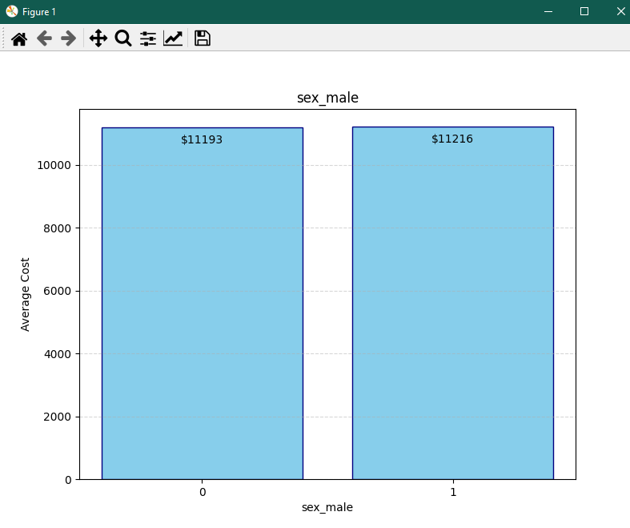

---

### 3. Gerçek vs. Tahmin Değer (Multiple Linear Regression)

Bu grafik, modelin ne kadar isabetli tahmin yaptığını gösterir. İdeal bir modelde tüm noktalar kırmızı kesik çizginin üzerine düşmelidir. Noktaların çizgiye yakınlığı, modelin güvenilirliğini kanıtlar.

Multiple Linear Regression için RMSE = 975,73 hesaplanır, bu da modelin yaklaşık olarak 975,73 dolar saptığını gösterir
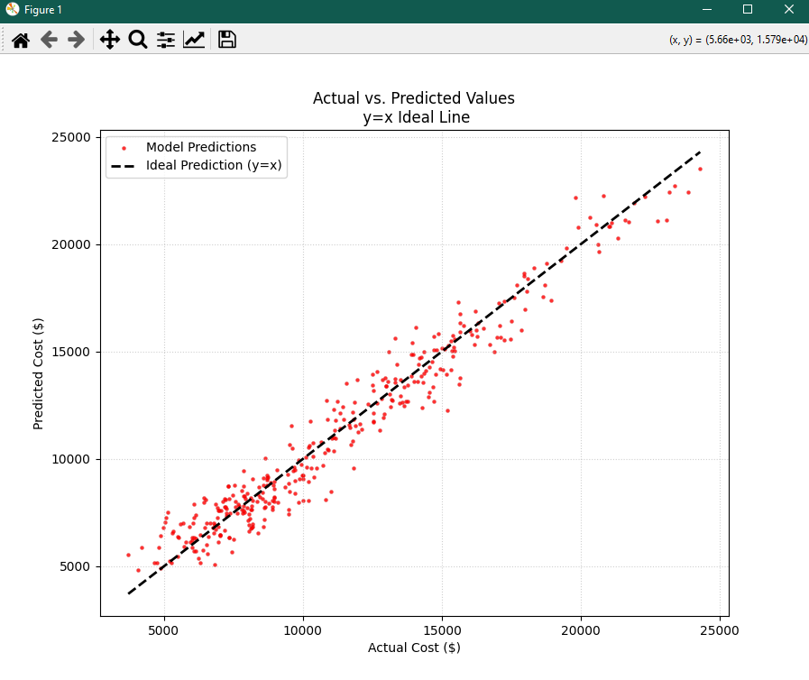

---

## Örnek Hasta Analizi

Modelin test verileri üzerinden rastgele seçilen tek bir hasta üzerinde nasıl tahmin yaptığını ve hatasını gösterir.

 

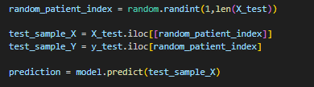

Örnek Bazı Özellikler
| Özellik (Feature) | Değer (Value) 
| :--- | :--- 
| age | 40 
| bmi | 42.1 
| children | 1 
| exercise\_frequency | 1.0 
| annual\_income | 36246  
| chronic\_disease\_none | 1 

| Ölçülen | Sonuç |
| :--- | :--- |
| Model Prediction | $8345.30 |
| Actual Value | $8389.83 |
| Difference | $-44.53 |
| Percentage Error | %-0.53 |

Multiple Linear Regression ile oluşturulan model train verisetinde bulunmayan (%20 Test verisetinde bulunan) bir hasta üzerinde tahmin yürüttüğünde %99,47 başarılı olabiliyor. Tabi ki Bu sonuç bazı hastalar için daha tutarsız, bazı hastalar için daha tutarlı olabiliyor. Örneğin bazı hastalar için hata yüzdesi %10 , bazı hastalar için %0.1 çıkabiliyor.

## c) Polynomial Regression (Polinomsal Regresyon)

Multiple Linear Regression olaylara biraz "düz mantık" yaklaşır. Yani verilerin üzerinden cetvelle çizilmiş gibi dümdüz bir çizgi çekmeye çalışır. Ama gerçek hayatta işler her zaman böyle doğrusal gitmez. Örneğin yaş ilerledikçe sağlık masrafları sabit bir hızda artmaz, belli bir yaştan sonra aniden fırlayabilir.

Polynomial Regression ise düz olan bu çizginin bükülmesine izin verir. 

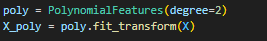

### 1. Özelliklerin (Feature) Maliyete Etkileri

Aşağıdaki görsellerde modelin yaş, yıllık gelir ve BMI verilerine göre çizdiği genel eğilimleri görüyoruz. İlk bakışta, bu çizgilerin Multiple Linear Regression'daki düz çizgilerden çok farklı değilmiş gibi gözüküyor.

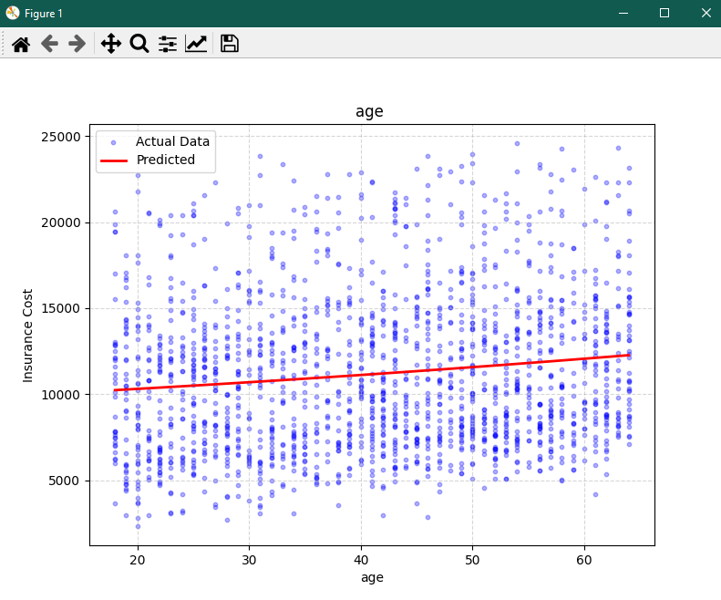 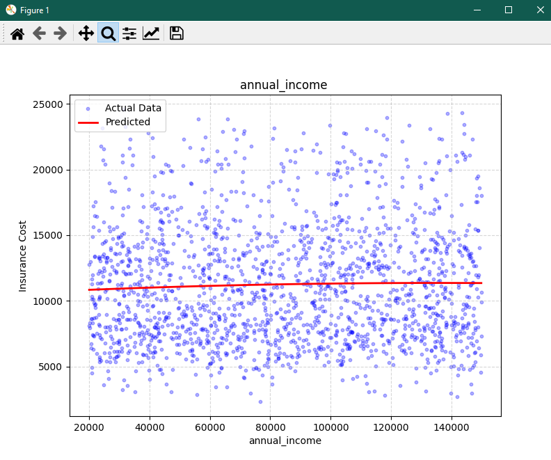 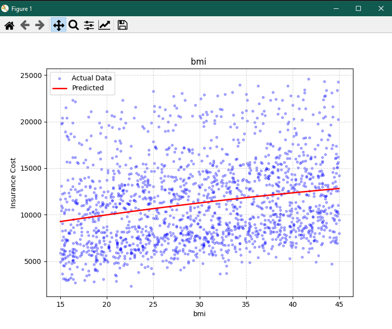

### 2. Detaylı İnceleme (Yakınlaştırılmış)

Ancak grafiklere daha yakından bakıldığında, modelin aslında dümdüz bir çizgi yerine hafif kavisli bir yol izlediği görülür.

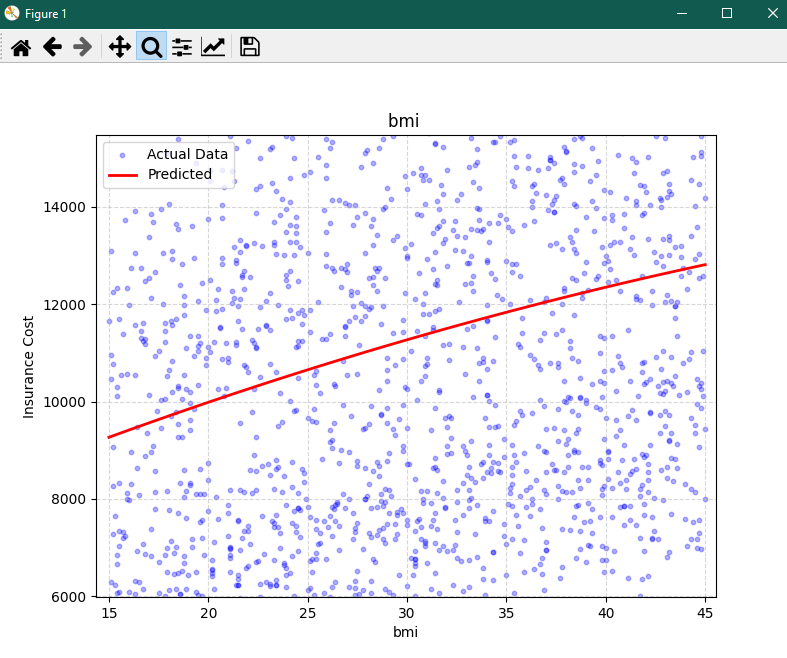 

---

### 3. Gerçek vs. Tahmin Değer (Polynomial Regression)

Polynominal Regression için RMSE = 1192,03 hesaplanır , bu da modelin yaklaşık olarak 1192 dolar saptığını gösterir

Polinomsal modelin test verisi üzerindeki genel başarısı aşağıdadır. Noktaların ideal çizgiye (y=x) olan yakınlığı, modelin tahmin gücünü gösterir.

---
# Sonuç
Bu projede, hastaların sağlık verileri kullanılarak sayısal bir değer (sağlık sigorta maliyeti) tahmin etmek istediğim için Classification ve Logistic Regression yöntemleri bu veriseti için uygun değil. Bu nedenle sadece Regression modelleri üstünde çalıştım.

* Simple Linear Regression: Tek feature üzerinde çalışabildiği için çok feature bulunan bu veriseti için yetersiz kaldı.
* Multiple Linear Regression: RMSE 975 olduğu için, bu veriseti içn diğer yöntemlerden daha iyi sonuçlar verdi.
* Polynominal Regression: RMSE değeri bu yöntemle 1192 hesaplandı. Bu sonuç Multiple Linear Regressiondan daha kötü olduğu için, Polynominal Regression bu veriseti için yetersiz kaldı.
